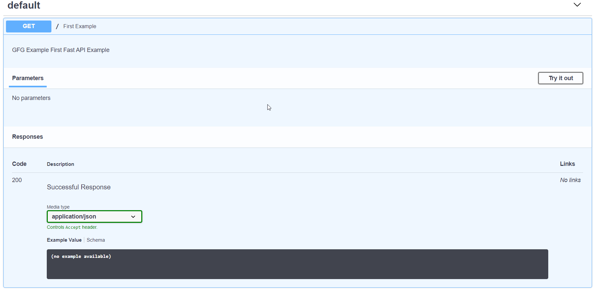

# Jawaban No 2

#### A. SPA (5 poin)

> Jelaskan apa itu SPA (Single Page Application) dan bagaimana SPA berbeda dari aplikasi web tradisional? Sebutkan juga beberapa keuntungan dan kerugian menggunakan SPA dalam pengembangan web.   
  
SPA (Single page application) merupakan website yang dibangun sedemikian sehingga pengguna hanya mengakses satu halaman saja untuk keseluruhan aksi dan untuk setiap pergantian halaman _page_, dilakukan pergantian komponen yang diperlukan saja dalam _page_ tersebut. Perbedaan dengan aplikasi web tradisional diantaranya,
1. Penggunaan SPA dapat meningkatkan pengalamana pengguna, utamanya di waktu respons yang diperlukan untuk mengganti komponen dari suatu halaman karena hanya perlu meminta data yang diperlukan dan komponen tertentu saja dibandingkan mengirim seluruh data ke _frontend_.
2. Aplikasi web tradisional menggunakan pengiriman data berupa halaman secara penuh apabila terjadi pergantian path URL, sementara single page application hanya meminta data dan komponen yang diperlukan saja.
3. Penggunaan SPA cenderung menggunakan teknologi modern yang berdiri diatas AJAX (_
Asynchronous Javascript and XML) untuk mengurangi perpindahan data antara _frontend & backend_, sementara web tradisional biasanya dikembangkan menggunakan teknologi lama seperti PHP versi 7.0, dsb.
4. SPA cenderung memiliki _initial load_ yang lama, sementara web tradisional biasanya lebih cepat.
  
Keuntungan dalam penggunaan SPA adalah sebagai berikut.
1. _Respons time_ yang cenderung cepat setelah melakukan loading di awal
2. Pengalaman pengguna yang cenderung baik dan mudah digunakan
3. Kemudahan dalam mengatur _state management_ yang perlu dilakukan  
  
Kerugian dalam penggunaan SPA adalah sebagai berikut.
1. Kesulitan dalam implementasi karena biasanya membutuhkan _framework_ javascript yang 
biasanya terus berkembang dan memiliki _workflow_ yang relatif rumit.
2. Performance time yang cenderung buruk di awal karena server mengirimkan data yang diperlukan ke client terlebih dahulu
3. Kesulitan dalam menerapkan SEO karena SPA cenderung tidak memberikan halaman utama yang dapat menjelaskan isi dari website kepada _search engine_ di awal / secara otomatis. 

#### B. Service dalam Backend (5 poin)

> Jelaskan apa itu Service dalam konteks Backend (misalnya Flask/FastAPI), dan bagaimana service membantu modularitas dalam pengembangan backend?  
  
Service dalam konteks backend merupakan endpoint yang dapat diakses oleh pihak public untuk melakukan suatu fungsionalitas tertentu sesuai data / deskripsi service tersebut. Service biasanya diterapkan dalam bentuk endpoint path beserta dengan HTTP methods yang diperlukan untuk mengakses atau memberikan pengaruh pada server. Sebagai contoh, Flask / FastAPI merupakan framework backend yang dibangun menggunakan bahasa Python dan dapat diakses menggunakan berbagai HTTP method yang telah dinyatakan, seperti contoh berikut.
  

Selanjutnya, peran service dalam konteks backend adalah untuk membagi berbagai fungsionalitas yang ditanggung oleh backend ke berbagai endpoint. Setiap endpoint tersebut memiliki fungsionalitas tertentu berdasarkan path dan HTTP method yang digunakan, seperti method GET 
untuk URI path / pada contoh diatas.

#### C. Implementasi GCS (35 poin)

> Buatlah sebuah aplikasi GCS (Ground Control Station) sederhana untuk manajemen waypoint.
> ##### Spesifikasi Teknologi
> - **Backend**: Golang dengan framework Gin, Echo, atau Fiber
>- **Database**: SQLite
>- **Frontend**: Svelte/SvelteKit
>- **Containerization**: Frontend dan Backend harus di-*containerize* menggunakan Docker dan dikelola menggunakan Docker Compose.
>
>##### Deskripsi Fitur
>
>###### A. Tampilan peta full-window
>
>- Aplikasi menampilkan peta full-window menggunakan pustaka Leaflet.js atau Mapbox GL JS.
>- Waypoint ditampilkan sebagai marker SVG kustom dari [logo Aksantara ITB](./aksantara.svg) di peta.
>
>###### B. Manajemen Waypoint
>
>- Aplikasi menampilkan floating sidebar yang berisi daftar waypoint yang telah dibuat.
>- Pengguna dapat menambahkan waypoint dengan mengklik pada peta. Setiap waypoint harus memiliki ID unik, koordinat (latitude dan longitude), ketinggian, dan nama yang dapat diedit.
>- Tiap item waypoint di sidebar memiliki tombol untuk mengedit nama waypoint dan menghapus waypoint.
>- Terdapat tombol "save" di sidebar untuk menyimpan semua waypoint ke database SQLite melalui API backend.
>
>###### C. Validasi dan Error Handling
>- Latitude harus berada di rentang -90 hingga 90,
>- longitude harus berada di rentang -180 hingga 180, 
>- ketinggian harus berupa angka positif,
>- nama waypoint tidak boleh kosong.
>- Tampilkan pesan error yang sesuai di UI jika ada input yang tidak valid.
>- Tampilkan pesan konfirmasi saat waypoint berhasil ditambahkan, diedit, dihapus, atau disimpan.
>
>##### Pengumpulan
>
> Cukup cantumkan file kode sumber di dalam folder yang sesuai beserta screenshot aplikasi yang sedang berjalan.

Sumber kode terhadap soal nomor diatas dapat dilihat pada folder `/CaRSC-13523048-GCS-THT2` dan berikut hasil tangkapan layar tampilan GCS yang telah dibuat. 

## Source 
- https://stackoverflow.com/questions/21862054/single-page-application-advantages-and-disadvantages
- https://gin-gonic.com/en/docs/quickstart/

## Notes
- Kalau mau clone, do it using this command   
`git clone --recurse-submodules https://github.com/Pendidikan-RSC-Aksantara-ITB/tht2-BrianHadianSTEI23`