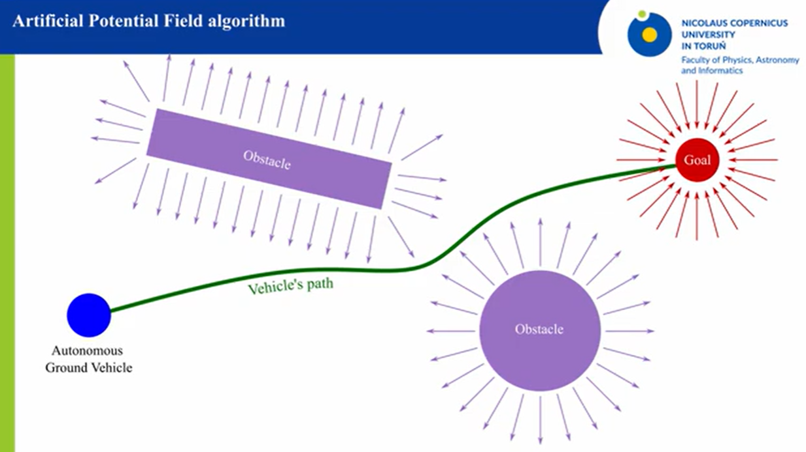
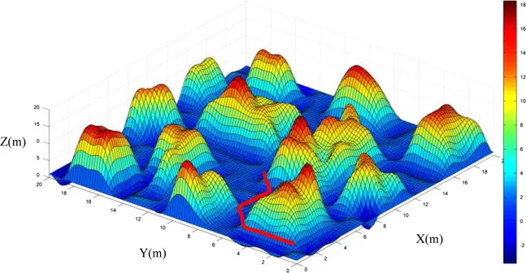
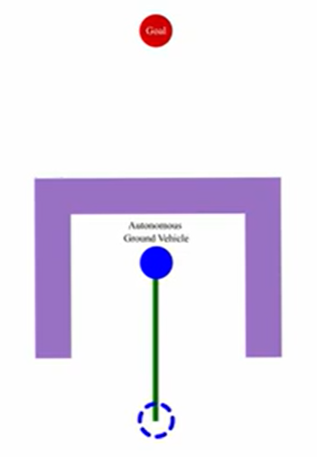

# Jawaban No. 3

> ### 3. Path Planning dan Swarm Control (45 poin)
> #### A. Penjelasan (10 poin)
><ol type="a">
><li> (5 poin) Jelaskan konsep dasar dari Artificial Potential Field (APF) dalam konteks navigasi robot. Sertakan penjelasan tentang bagaimana gaya tarik dan tolak bekerja dalam metode ini dan sertakan ilustrasi atau diagram yang digambar sendiri di kertas atau papan tulis digital.</li>
><li> (5 poin) Jelaskan perbedaan antara Uniform Cost Search (UCS), Greedy Best First Search (GBFS), dan A* Search dalam konteks algoritma pencarian jalur. Sertakan kelebihan dan kekurangan masing-masing algoritma serta situasi di> mana masing-masing algoritma lebih cocok digunakan.</li>
></ol>  
 
a. Berdasarkan sumber [berikut](https://medium.com/@rymshasiddiqui/path-planning-using-potential-field-algorithm-a30ad12bdb08) dan [berikut](https://www.youtube.com/watch?v=FJSlUPzLjqQ), cara kerja dari Artificial Potential Field (APF) bekerja dengan menggunakan cara kerja yang diadopsi dari cara kerja potensial listrik dengan memanfaatkan gaya tarik dan gaya tolak. Cara kerja utama dari algoritma ini adalah :
1. Benda awal (drone) diasumsikan memiliki suatu potensial listrik dengan polaritasi tertentu   
2. Target / benda tujuan diasumsikan memiliki potensial listrik dengna polaritas berlawanan dari benda awal
3. Benda selain kedua hal sebelumnya diasumsikan memiliki polaritas yang sama dengan benda awal (drone)  
  
Dalam melakukan path planning, drone diasumsikan sudah mengetahui posisi seluruh objek / dapat memperoleh posisi setiap objek di daerah yang telah diatur. Selanjutnya, drone akan melakukan pemetaan nilai fungsi potensial yang sesuai dengan sifatnya (benda / target tujuan memiliki daya tarik, sementara lainnya memiliki daya tolak) berdasarkan suatu fungsi tertentu. Tujuan dari penggunaan daya tarik dan tolak ini adalah untuk memastikan bahwa benda awal (drone) dapat bergerak menuju titik yang memiliki daya tarik tersebut, seperti pada ilustrasi berikut.  
  

  
Kemudian, drone akan melakukan pemetaan terhadap setiap objek beserta dengan nilai fungsinya yang merepresentasikan tujuan yang hendak dicapai. Drone (benda awal) akan bergerak melalui daerah yang memiliki nilai fungsi daya tolak yang cenderung rendah dan harapannya dapat mencapai titik dengan nilai fungsi terendah yang mereprentasikan potensial terendah, yakni sudah mencapai titik tujuan yang memiliki daya tarik terhadap benda awal tersebut. Sebagai contoh, digunakan referensi berikut untuk mempermudah gambaran dari pemetaan fungsi tersebut dalam peta asli.
  

  
Dalam contoh di atas, sumbu X dan Y menggambarkan lokasi pada peta asli sementara sumbu Z merepresntasikan nilai fungsi yang diperoleh berdasarkan ketentuan sebelumnya. Garis merah tersebut merupakan gerak / _path_ yang diharapkan diambil oleh benda awal (drone).
  
Terdapat beberapa kekurangan dari penerapan cara ini, diantaranya adalah,
1. Dapat terjadi posisi yang menggambarkan _local minima_ sementara seharusnya mencapai titik _global minima_, seperti pada contoh berikut.
  

  
2. Benda awal bisa tidak mau mendekati titik tujuan karena titik tujuan berada di ruang yang sempit dengan _obstacle_ lain, tetapi seharusnya bisa.
3. Terjadinya osilasi terhadap gerakan benda awal (drone) karena melalui suatu daerah dengan _obstacles_ densitas tinggi.

> #### B. Implementasi (35 poin)
> Perhatikan [paper ini](https://informatika.stei.itb.ac.id/~rinaldi.munir/Stmik/2024-2025/Makalah2025/Makalah-IF2211-Strategi-Algoritma-2025%20(96).pdf). Gunakan algoritma *swarming* yang dijelaskan di dalamnya untuk mengimplementasikan simulasi robot swarm di lingkungan 2D dengan pustaka Pygame. Mulanya robot-robot akan ditempatkan secara acak di dalam area tertentu (mis. 100 x 200 piksel di pojok kiri atas jendela Pygame) dan memiliki tujuan untuk mencapai target titik tertentu (mis. di pojok kanan bawah jendela Pygame). Bentuk rintangan dan cara penempatan rintangan dapat ditentukan sendiri (fixed atau random). Asumsikan robot-robot tersebut dapat berkomunikasi satu sama lain untuk berbagi informasi tentang posisi satu sama lain dan rintangan di sekitarnya. Asumsikan juga kondisi lingkungan statis (rintangan tidak bergerak) dan sepenuhnya diketahui oleh semua robot. Simulasi harus menampilkan pergerakan robot secara real-time di jendela Pygame.
> 
> Cukup cantumkan file kode sumber di dalam folder yang sesuai beserta GIF hasil rekaman simulasi (bisa dari screen recorder seperti OBS Studio atau lainnya). Detail implementasi yang tidak dijelaskan di sini dapat diasumsikan sendiri selama sesuai dengan konsep dasar yang dijelaskan di dalam paper.
  
Hasil kode dapat dilihat pada folder `/src/3/CaRSC26-13523048-BoidsSwarmingAlgorithm` dan berikut merupakan sneak peek.  
  

  
Seluruh implementasi sudah mirip dengan paper yang diberikan, tetapi terdapat kekurangan dari implementasi sekarang, yakni penggunaan algoritma Boids hanya terbatas pada obstacle yang cenderung kecil karena apabila terlalu besar, daya tolaknya akan terlalu besar sehingga swarm tidak akan bergerak kemanapun.

# Source
- https://medium.com/@rymshasiddiqui/path-planning-using-potential-field-algorithm-a30ad12bdb08
- https://www.youtube.com/watch?v=FJSlUPzLjqQ