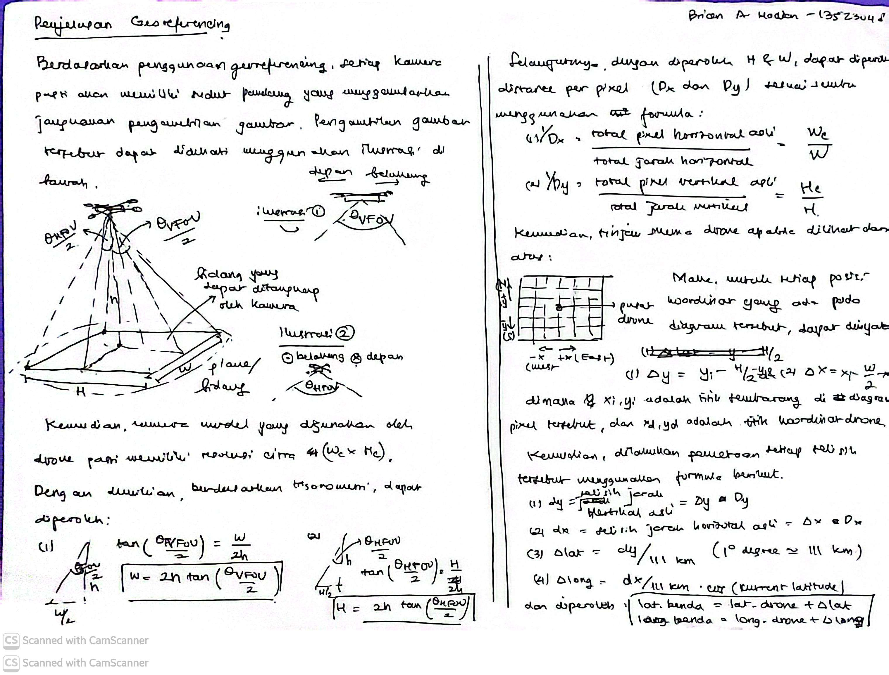

# Jawaban No. 5
Untuk jawaban nomor 5, dapat dilihat pada gambar berikut.

# Notes
Persamaan konversi nilai $dx$ dan $dy$ menjadi nilai latitude dan longitude didasarkan pada sumber [berikut](https://stackoverflow.com/questions/7477003/calculating-new-longitude-latitude-from-old-n-meters) dan [berikut](https://www.youtube.com/watch?v=HaGj0DjX8W8).